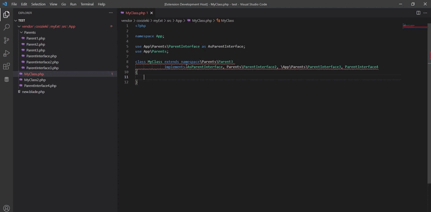

# PHP Implementor
Implement php interface/abstract class methods faster!

**Currently work in progress.**



For the extension to work, your project must follow the PSR-4 autoloading standarts, which means, that if you have a class with a namespace like this:

```php
   <?php 

   namespace App\Controllers;

   class IndexController {

   }
```

IndexController must be located in **"App/Controllers/IndexController.php"** file. However, extension allows you to define the location of your **"root"** namespace. For instance, let's define the location of **App** namespace from the example above, as if the **App** namespace was located in **"src/App"** folder:

```
     "php-implementor.autoloads": {
        "App": "src/App/"
    }
```